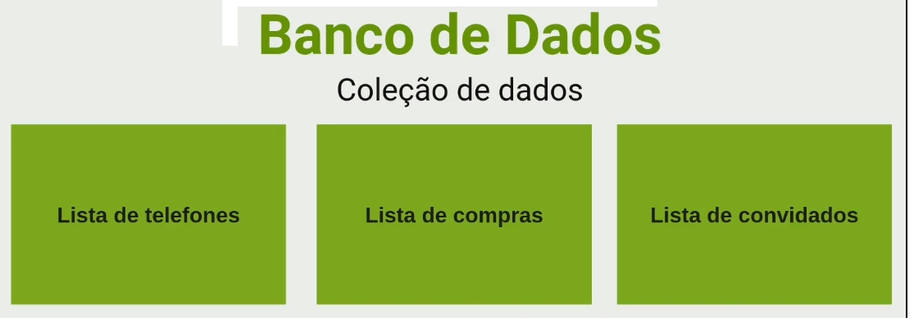
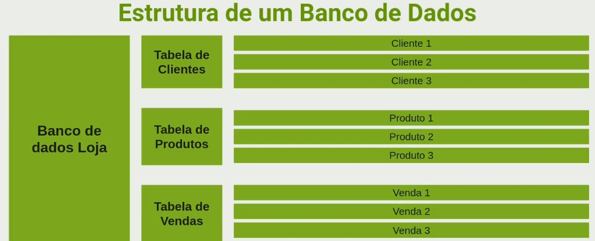
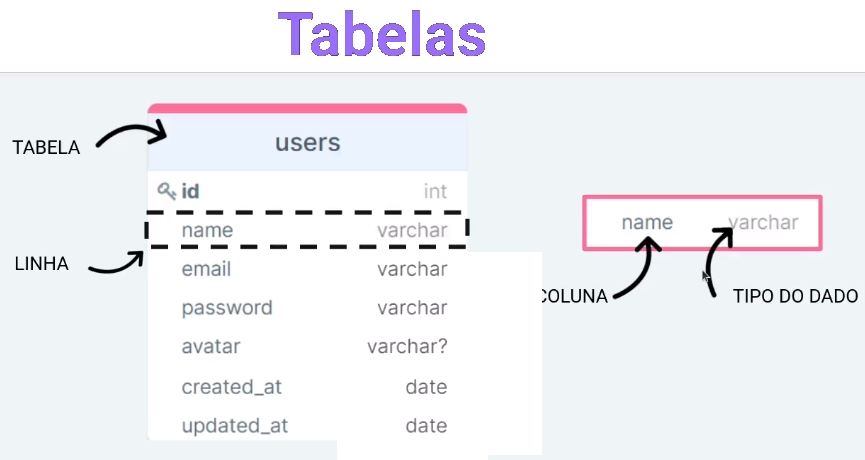
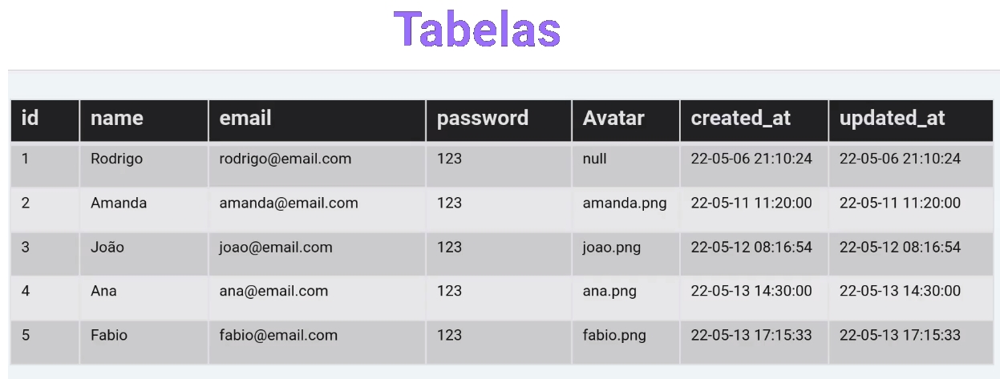
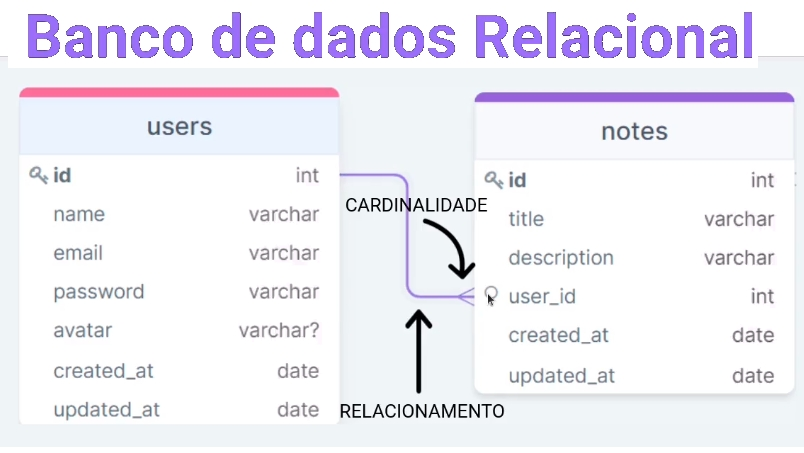
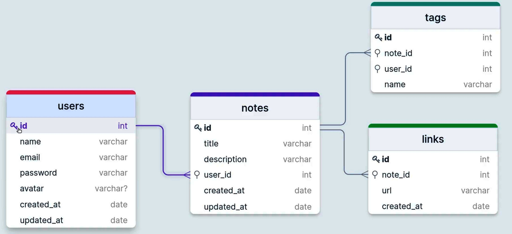
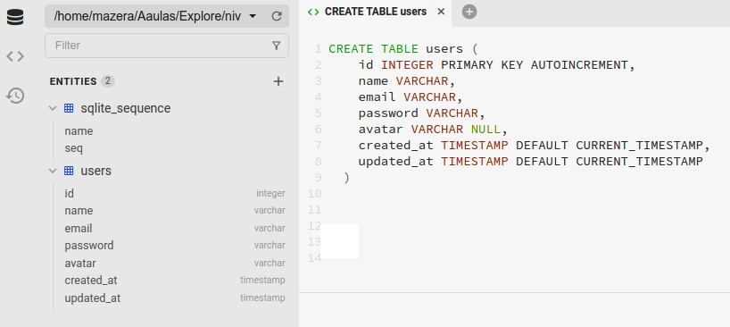
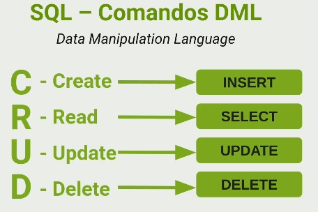
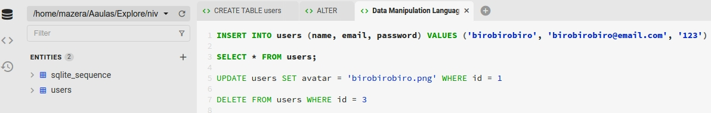

# src atual

- [controllers/](./src/controllers)
  - [UsersController.js](./src/controllers/UsersController.js)
- [routes/](./src/routes)
  - [index.js](./src/routes/index.js)
  - [users.routes.js](./src/routes/users.routes.js)
- [utils/](./src/utils)
  - [AppError.js](./src/utils/AppError.js)
- [server.js](./src/server.js)

# SQL

- O que é um banco de dados - 10:45: Nessa aula aprenderemos o que é um banco de dados e quais são as suas propriedades como: Tabela, linha, coluna, tipo de dado. Também aprenderemos o que é um banco de dados Relacional.
  
  
  
  
  

- Estrutura do Banco de Dados - 06:02: Nessa aula apresentaremos como será a estrutura do banco de dados do projeto que iremos desenvolver.
  

- Conectando com o banco de dados - 07:40: Nessa aula faremos a configuração inicial para que nosso projeto consiga se comunicar com o banco de dados SQLite.

  - npm install sqlite3 sqlite --save (dependência de produção)
  - Criar pasta database/sqlite/index.js

- SGBD (Sistema Gerenciador de Banco de DAdos) - 02:23: Nessa aula instalaremos a ferramenta Beekeper Studio para que consigamos visualizar e executar funções em nosso banco da dados.

  - [Open Source SQL Editor and Database Manager](https://www.beekeeperstudio.io/)
    

- Criando tabela de usuário - 08:49 - Nessa aula com a utilização do Beekeper Studio, criaremos a nossa primeira tabela no banco de dados.

  - Comando para criar a tabela `users`:
      <pre>
      CREATE TABLE users (
      id INTEGER PRIMARY KEY AUTOINCREMENT,
      name VARCHAR,
      email VARCHAR,
      password VARCHAR,
      avatar VARCHAR NULL,
      created_at TIMESTAMP DEFAULT CURRENT_TIMESTAMP,
      updated_at TIMESTAMP DEFAULT CURRENT_TIMESTAMP
    )
    </pre>
    

- SQL - 03:04 - Nessa aula aprenderemos o significado de SQL (Structured Query Language), ou Linguagem de Consulta Estruturada. É a linguagem padrão para banco de dados relacionais. Também aprenderemos sobre comandos DML (Data Manipulation Language)

  - Structured Query Language, ou Linguagem de Consulta Estruturada ou SQL, é a linguagem de pesquisa declarativa padrão para banco de dados relacional.
  - DDL ou Data Definition Language (Linguagem de Definição de dados) - permite ao usuário definir as novas tabelas e os elementos que serão associados a elas. É responsável pelos comandos de criação e alteração no banco de dados, sendo composto por três comandos: `CREATE`, `ALTER` e `DROP`.

- Alter - 05:23: Nessa aula aprenderemos a alterar o nome das tabelas, adicionar e deletar colunas do banco de dados.

  - Alterar nome da tabela:
    `ALTER TABLE users`
    `RENAME TO clients`

  - Adicionando coluna status:
    `ALTER TABLE users`
    `ADD status VARCHAR`

  - Renomeando coluna status :
    `ALTER TABLE users`
    `RENAME COLUMN status TO active`

  - Deletando coluna status:
    `ALTER TABLE users`
    `DROP COLUMN status`

- Comando DDL - 04:27 - Nessa aula aprenderemos os conceitos dos comandos DDL (Data Definition Language) - `INSERT`, `SELECT`, `UPDATE` e `DELETE`.
  

- Manipulando Dados - 15:29 - Nessa aula aprenderemos como inserir, buscar, atualizar e deletar os registros na tabela `users`.

  - O DML ou Data Manipulation Language (Linguagem de Manipulação de Dados) interage diretamente com os dados dentro das tabelas. Possui três comandos para esta manipulação: `INSERT`, `UPDATE` e `DELETE`.
  - DQL ou Data Query Language possui apenas um único comando: O `SELECT`.

  - Inserindo dados na tabela users:
    `INSERT INTO (users name, email, password) VALUES ('birobirobiro', 'birobirobiro@email.com', '123');`
  - Buscando registros na tabela users:
    `SELECT * FROM users;`
  - Atualizando registros:
    `UPDATE users SET avatar = 'birobirobiro.png' WHERE id = 1`
  - Deletando registros:
    `DELETE FROM users WHERE id = 3`
    

- Migrations - 07:08 - Nessa aula aprenderemos como automatizar a criação do banco de dados utilizando as Migrations.
  - Criar sqlite/migrations/createUsers.js; index.js
- Select - 07:02
- Cadastrando usuário - 04:33
- Criptografando senha do usuário - 05:18
- Atualizando usuário - 10:57
- Atualizando senha - 05:14
- Datetime do Banco - 03:29
- Validando nome e e-mail - 02:55
